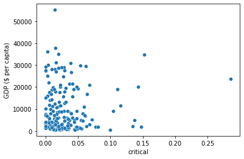
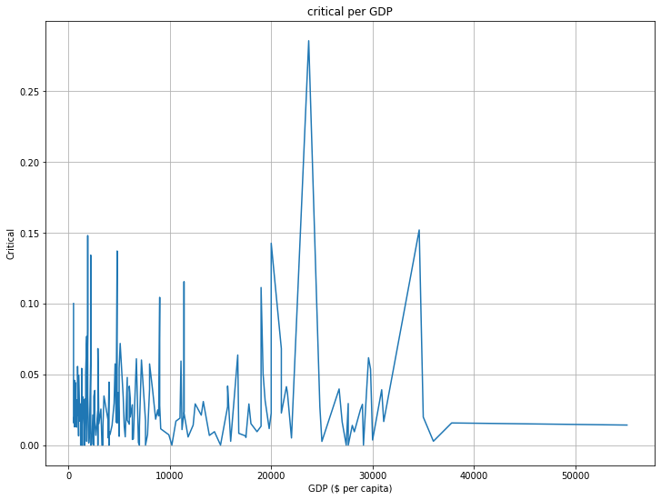
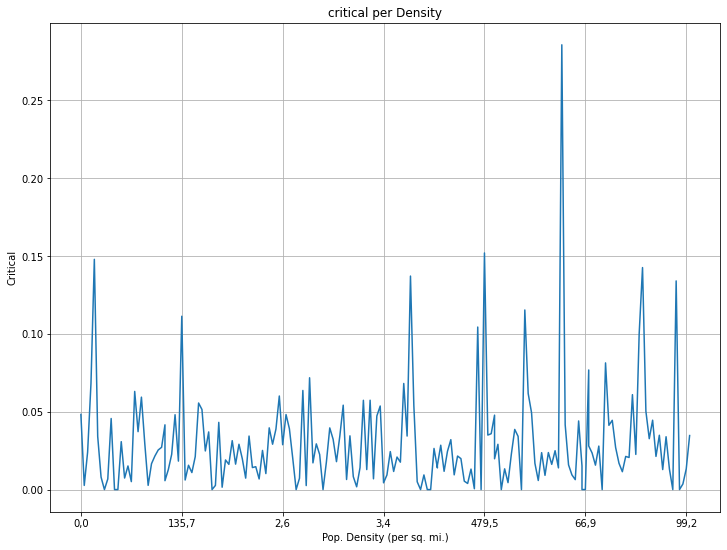

# 가설 1. 1인당 GDP는 치명률과 상관관계가 있을것이다.


```python
import numpy as np
import pandas as pd
import matplotlib.pyplot as plt
import seaborn as sns
```


```python
covid_df = pd.read_csv("./country_all.csv")
```


```python
covid_df.head(5)
```


<div>
<style scoped>
    .dataframe tbody tr th:only-of-type {
        vertical-align: middle;
    }

    .dataframe tbody tr th {
        vertical-align: top;
    }

    .dataframe thead th {
        text-align: right;
    }
</style>
<table border="1" class="dataframe">
  <thead>
    <tr style="text-align: right;">
      <th></th>
      <th>Unnamed: 0</th>
      <th>Country</th>
      <th>Confirmed</th>
      <th>Deaths</th>
      <th>Recovered</th>
      <th>Active</th>
      <th>New cases</th>
      <th>New deaths</th>
      <th>New recovered</th>
      <th>Deaths / 100 Cases</th>
      <th>...</th>
      <th>Phones (per 1000)</th>
      <th>Arable (%)</th>
      <th>Crops (%)</th>
      <th>Other (%)</th>
      <th>Climate</th>
      <th>Birthrate</th>
      <th>Deathrate</th>
      <th>Agriculture</th>
      <th>Industry</th>
      <th>Service</th>
    </tr>
  </thead>
  <tbody>
    <tr>
      <th>0</th>
      <td>0</td>
      <td>Afghanistan</td>
      <td>36263</td>
      <td>1269</td>
      <td>25198</td>
      <td>9796</td>
      <td>106</td>
      <td>10</td>
      <td>18</td>
      <td>3.50</td>
      <td>...</td>
      <td>3,2</td>
      <td>12,13</td>
      <td>0,22</td>
      <td>87,65</td>
      <td>1</td>
      <td>46,6</td>
      <td>20,34</td>
      <td>0,38</td>
      <td>0,24</td>
      <td>0,38</td>
    </tr>
    <tr>
      <th>1</th>
      <td>1</td>
      <td>Albania</td>
      <td>4880</td>
      <td>144</td>
      <td>2745</td>
      <td>1991</td>
      <td>117</td>
      <td>6</td>
      <td>63</td>
      <td>2.95</td>
      <td>...</td>
      <td>71,2</td>
      <td>21,09</td>
      <td>4,42</td>
      <td>74,49</td>
      <td>3</td>
      <td>15,11</td>
      <td>5,22</td>
      <td>0,232</td>
      <td>0,188</td>
      <td>0,579</td>
    </tr>
    <tr>
      <th>2</th>
      <td>2</td>
      <td>Algeria</td>
      <td>27973</td>
      <td>1163</td>
      <td>18837</td>
      <td>7973</td>
      <td>616</td>
      <td>8</td>
      <td>749</td>
      <td>4.16</td>
      <td>...</td>
      <td>78,1</td>
      <td>3,22</td>
      <td>0,25</td>
      <td>96,53</td>
      <td>1</td>
      <td>17,14</td>
      <td>4,61</td>
      <td>0,101</td>
      <td>0,6</td>
      <td>0,298</td>
    </tr>
    <tr>
      <th>3</th>
      <td>3</td>
      <td>Andorra</td>
      <td>907</td>
      <td>52</td>
      <td>803</td>
      <td>52</td>
      <td>10</td>
      <td>0</td>
      <td>0</td>
      <td>5.73</td>
      <td>...</td>
      <td>259,5</td>
      <td>10</td>
      <td>15</td>
      <td>75</td>
      <td>2</td>
      <td>22,46</td>
      <td>3,27</td>
      <td>NaN</td>
      <td>NaN</td>
      <td>NaN</td>
    </tr>
    <tr>
      <th>4</th>
      <td>4</td>
      <td>Angola</td>
      <td>950</td>
      <td>41</td>
      <td>242</td>
      <td>667</td>
      <td>18</td>
      <td>1</td>
      <td>0</td>
      <td>4.32</td>
      <td>...</td>
      <td>497,2</td>
      <td>2,22</td>
      <td>0</td>
      <td>97,78</td>
      <td>3</td>
      <td>8,71</td>
      <td>6,25</td>
      <td>NaN</td>
      <td>NaN</td>
      <td>NaN</td>
    </tr>
  </tbody>
</table>
<p>5 rows × 36 columns</p>
</div>


치명률은 = Deaths /  Confirmed
gdp 기준 내림차순 정렬


```python
covid_df['critical'] = covid_df['Deaths'] / covid_df['Confirmed']
```


```python
sns.scatterplot(x = covid_df['critical'],y = covid_df['GDP ($ per capita)'])
```


    <AxesSubplot:xlabel='critical', ylabel='GDP ($ per capita)'>


    

    


```python
sorted_data = covid_df.sort_values(by=['GDP ($ per capita)'], axis=0)
```


```python

fig = plt.figure(figsize=(12,9))
plt.title("critical per GDP")
plt.plot(sorted_data['GDP ($ per capita)'], sorted_data['critical'])
plt.xlabel("GDP ($ per capita)")
plt.ylabel("Critical")
plt.grid(True)
```


    

    


```python
sorted_data = covid_df.sort_values(by=['Pop. Density (per sq. mi.)'], axis=0)
```


```python
sorted_data['Pop. Density (per sq. mi.)'].tail(1)
```


    9    99,9
    Name: Pop. Density (per sq. mi.), dtype: object


```python

fig = plt.figure(figsize=(12,9))
plt.title("critical per Density")
plt.plot(sorted_data['Pop. Density (per sq. mi.)'], sorted_data['critical'])
plt.xlabel("Pop. Density (per sq. mi.)")
plt.ylabel("Critical")
plt.xticks([i for i in range(0, 200, 30)])
plt.grid(True)

plt.show()
```


    

    


```python

```


```python

```
